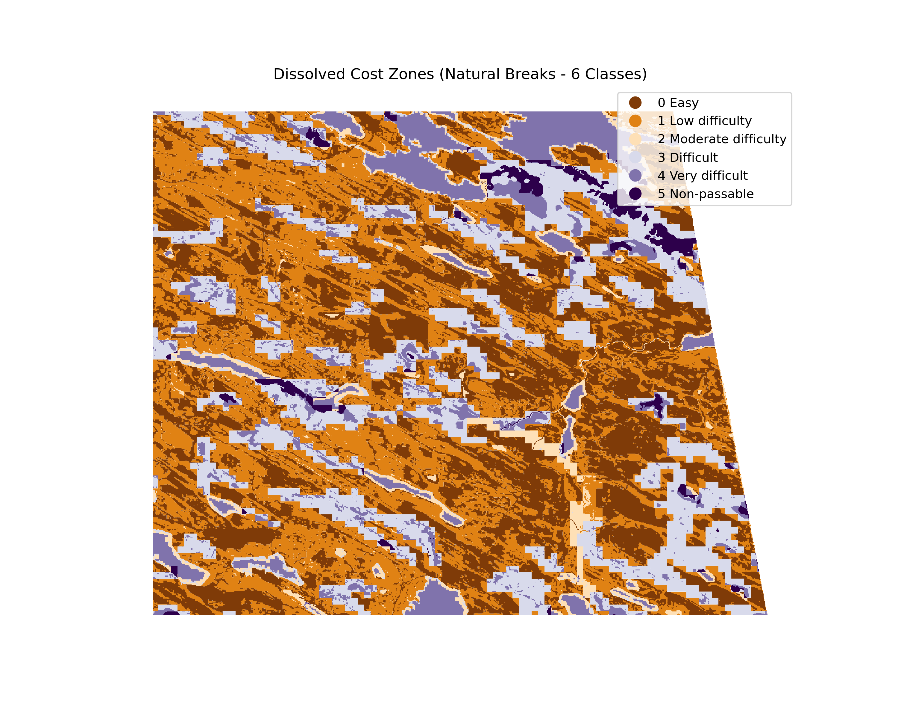

# CostLayer calculation with GeoCubesFI

Cost Layer evaluation for vehicle mobility in remote terrain in Finland. 

This repository contains a task that exemplify the calculation of a Cost Layer for Mobility of vehicles in remote terrain. A Cost Layer is a geoinformatics technique that give understanding of the areas/zones that has the most probability to occur (of the least cost). It is created with a selection of variables that has a certain value (degree of cost) and are gathered all together to generate a general perspective.
For this task layers like Terrain, Land Use, Environment, and Roads will be used.

## Online Demo

Take a closer look to the result Cost Layer in this online demo.

🌎 [Cost Layer online demo](https://bryanvallejo16.github.io/CostLayer-GeoCubesFI/)

## Data

the data was gathered from the [GeoCubes Finland](https://vm0160.kaj.pouta.csc.fi/geocubesclient/). A servive for remote sensing data in Finland. Also, from OpenStreetMap.

- Slope 10m 2022
- Deep-to-water index 16m 2023*
- Peatlands 10m 2020
- Superficial Deposits 100m 2018*
- Canopy cover 10m
- Roads
- Water bodies 

*resampled to 10 m

## Code

The process was divided in 6 sections for clarity. Find each process and Python code in the next Jupyter Notebooks.

- [00_Preparations.ipynb](00_Preparations.ipynb) ➡️ *Data preparation and resampling*

- [01_Layers.ipynb](01_Layers.ipynb) ➡️ *Layer normalization and check up*

- [02_TemplateLayer.ipynb](02_TemplateLayer.ipynb) ➡️ *Template layer creation*

- [03_CostLayer.ipynb](03_CostLayer.ipynb) ➡️ *Cost Layer calculation*

- [04_SentinelChangeDetect.ipynb](04_SentinelChangeDetect.ipynb) ➡️ *Change Detection with Sentinel 2*

- [05_Classify_CostLayer.ipynb](05_Classify_CostLayer.ipynb) ➡️ *Classification of Cost Layer for Web*

## Results

The Cost Layer shows the "cost of mobility" based on terrain. The cost is normalized between 0 and 1. The lower values shows less cost (mobility is easier) and higher values represent more cost (mobility is difficult).

## Reference

This Task was done by Bryan R. Vallejo. A practical test for understading how Cost Layer works in terrain analysis.

